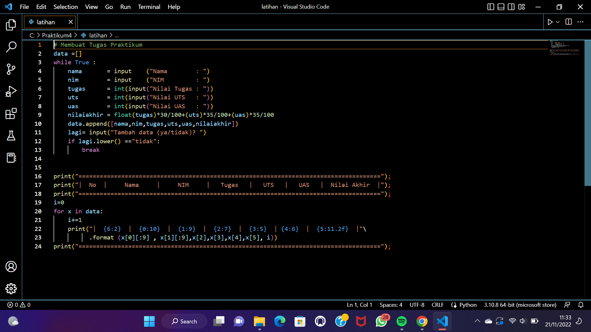
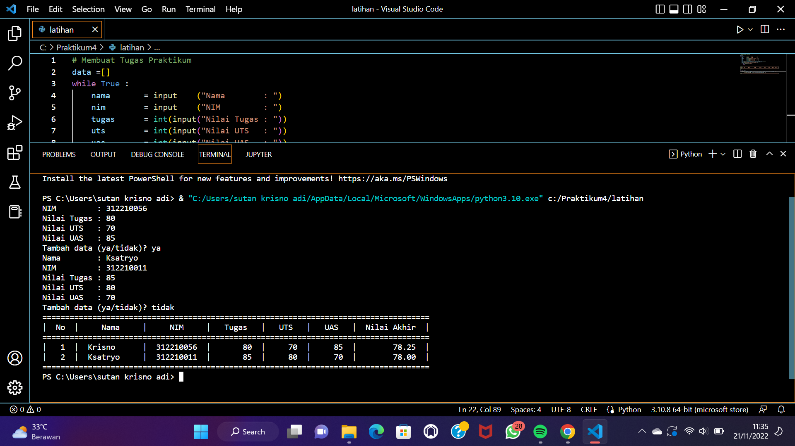
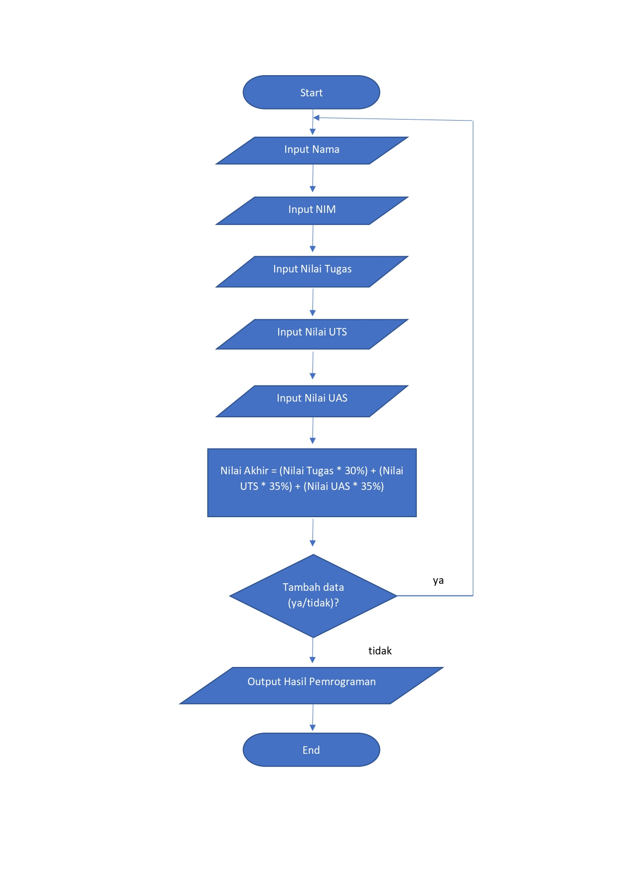

# Praktikum5

Buat program sederhana untuk menambahkan data kedalam sebuah list dengan rincian sebagai berikut:

  - Program meminta memasukan data sebanyak-banyaknya (gunakan perulangan)
  - Tampilkan pertanyaan untuk menambah data (ya/tidak?), apabila jawaban "tidak", maka program akan menampilkan daftar datanya.
  - Nilai akhir diambil dari perhitungan 3 komponen nilai (Tugas: 30%, UTS: 35%, UAS: 35%)
  - Buat flowchart dan penjelasan programnya pada README.md.
  - Commit dan push repository ke github.
  
# Langkah-langkah:
    1. Buat programnya terlebih dahulu seperti gambar dibawah ini
   

   
    2. Hasil Run
   

   
# Penjelasan Program :
    1. Buatlah list berupa Nama, NIM, Nilai Tugas, Nilai UTS, Nilai UAS.
    2. Lalu inputlah Nama, NIM, Nilai Tugas, Nilai UTS, Nilai UAS.
    3. Lalu mencari nilai akhir dengan perhitungan nilai tugas 30%, nilai uts 35%, dan uas 35% dengan perintah float
    4. Gunakan perintah append pada Nama, NIM, Nilai Tugas, Nilai UTS, Nilai UAS untuk menambahkan 1 item ke elemen terakhir.
    5. Jika ingin menambah list data ketik "ya" dan jika tidak ingin menambahkan data ke list ketik "tidak". Dengan perintah while jawab =="ya" dan if jawab =="tidak". Jawab imput ("Tambah data (ya/tidak)").
    6. Gunakanlah perulangan for dengan perintah for i in range (len(Nama)):. Fungsi "len" ialah untuk mengembalikan panjang (jumlah anggota) dari suatu objek.
    7. Lalu cetak dengan perintah print
    8. Selesai
    
# Flowchart Praktikum 4
  

  
# Sekian TerimaKasih